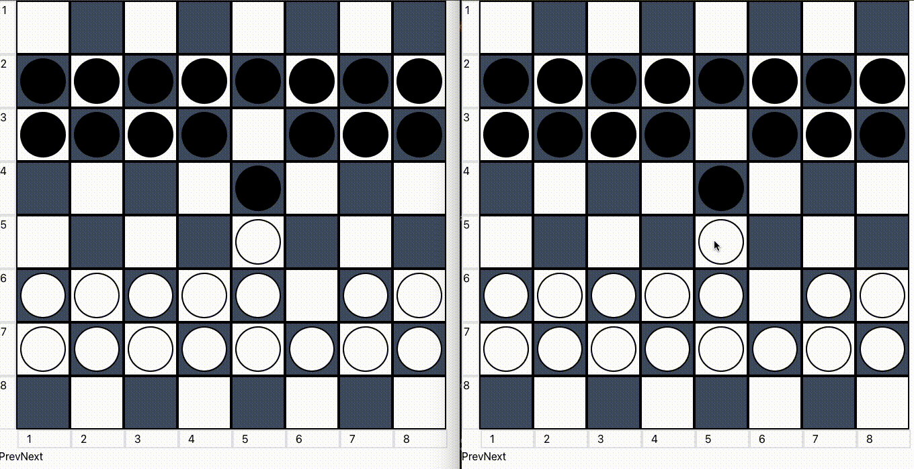

## Turkish Checkers or Dama

- this is the turkish checkers or Dama built on a 2D board.
you can fork and build on top of it.

# Overview 

# client 

- React was used to build the game logic

# server 

- Build with node js along with socket io